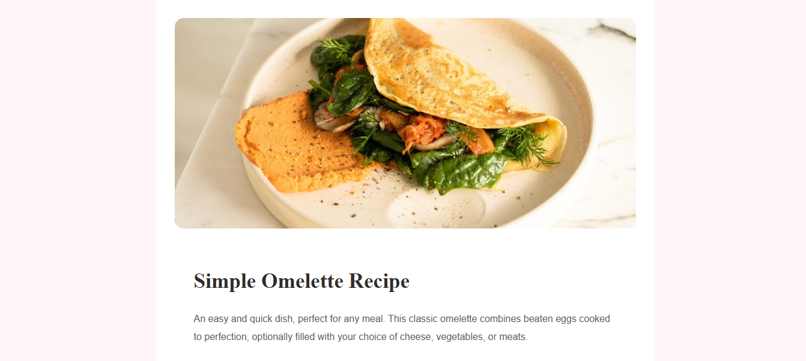
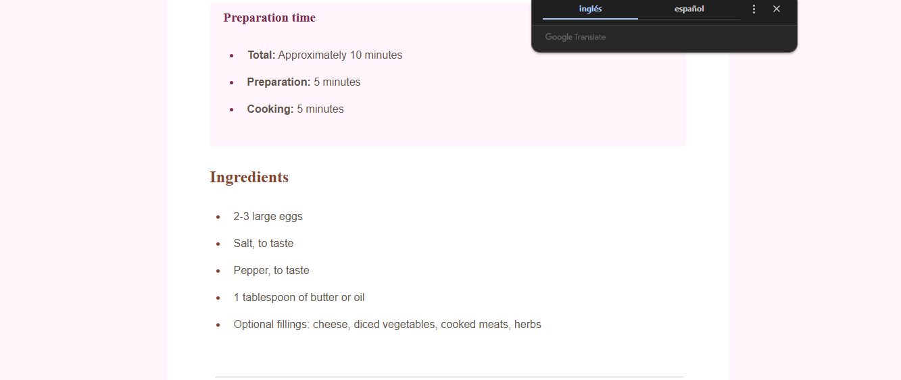
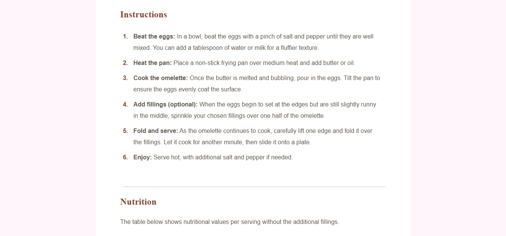
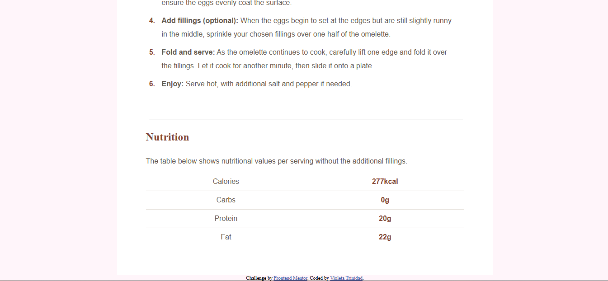
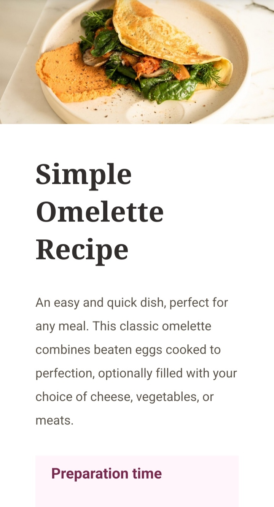
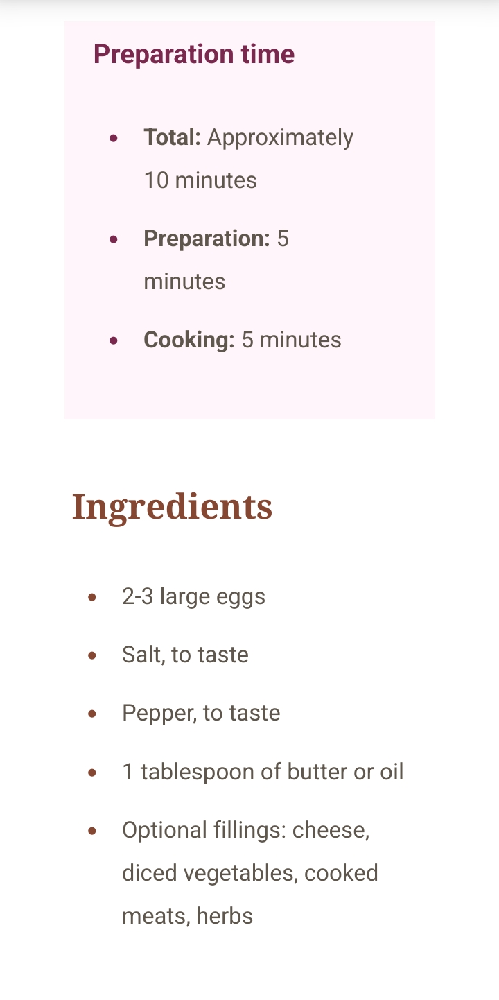
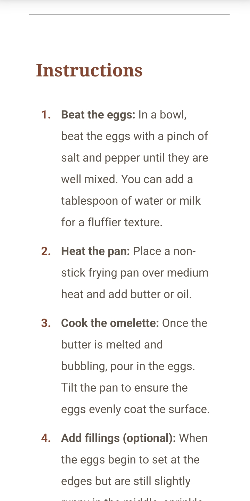
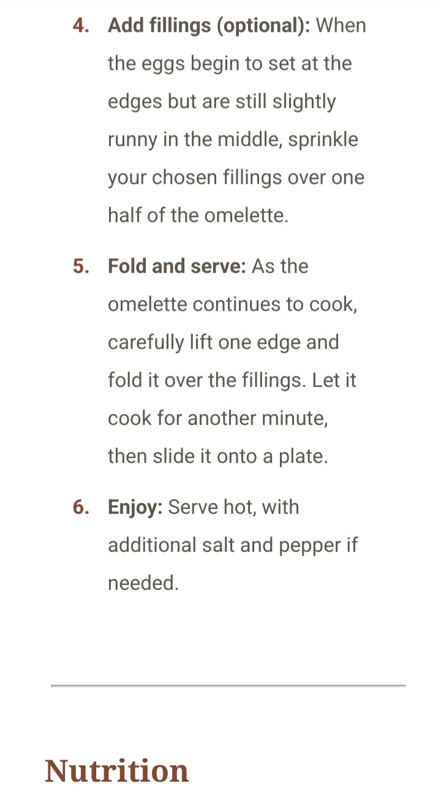
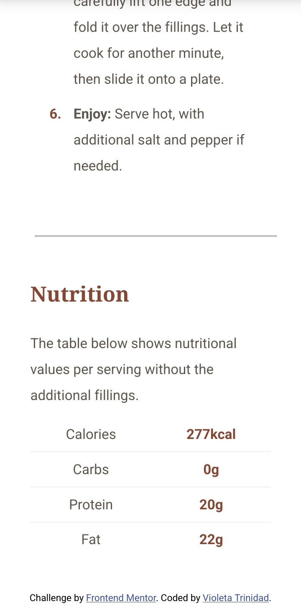

# Frontend Mentor - Recipe page solution

This is a solution to the [Recipe page challenge on Frontend Mentor](https://www.frontendmentor.io/challenges/recipe-page-KiTsR8QQKm). Frontend Mentor challenges help you improve your coding skills by building realistic projects. 

## Table of contents

- [Overview](#overview)
  - [Screenshot](#screenshot)
  - [Links](#links)
- [My process](#my-process)
  - [Built with](#built-with)
- [Author](#author)

## Overview

### Screenshot

### Links

- Solution URL: https://github.com/v-t-9/FrontEndMentorRecipePage
- Live Site URL: https://v-t-9.github.io/FrontEndMentorRecipePage/

### Built with

- Semantic HTML5 markup
- CSS3
- Flexbox
- Mobile-first workflow

## Author
Violeta Trinidad
- Website - https://v-t-9.github.io/PortfolioVioleta/
- Frontend Mentor - [@yourusername](https://www.frontendmentor.io/profile/yourusername)
- Twitter - [@v_t_9] https://twitter.com/v_t_9

